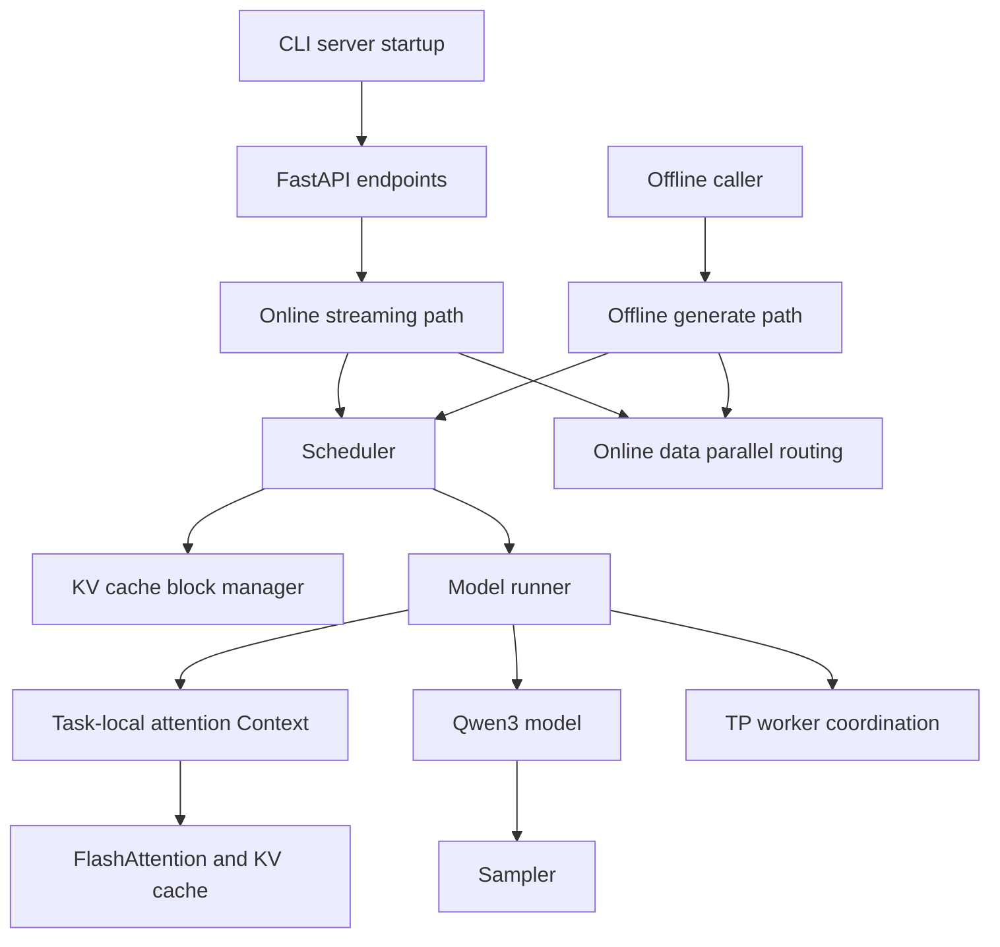

# BabyVllm Flowcharts

This directory collects Mermaid flowcharts for the core BabyVllm inference engine paths. The goal is to help readers build a source-grounded mental model before reading every implementation detail.

## Reading Order

1. [Engine Overview](engine-overview.md): top-level entrypoints and subsystem boundaries.
2. [Offline Generate](offline-generate.md): blocking batch generation with metrics.
3. [Online Streaming](online-streaming.md): async request routing and SSE-facing output.
4. [Scheduler](scheduler.md): decode-first scheduling, chunked prefill, and postprocess.
5. [KV Cache Block Manager](kv-cache-block-manager.md): block allocation and prefix reuse.
6. [Model Runner Forward](model-runner-forward.md): forward metadata, CUDA graph decode, and sampling.
7. [Attention And Context](attention-and-context.md): task-local context and FlashAttention paths.
8. [Parallelism](parallelism.md): tensor-parallel workers and data-parallel coordinators.
9. [Qwen3 Model](qwen3-model.md): model layers, parallel linear layers, logits, and sampler.

## Source Map

| Flowchart | Primary source modules |
| --- | --- |
| [Engine Overview](engine-overview.md) | `babyvllm/entrypoints/cli.py`, `babyvllm/entrypoints/api_server.py`, `babyvllm/engine/llm_engine.py`, `babyvllm/engine/async_llm_engine.py`, `babyvllm/engine/scheduler.py`, `babyvllm/engine/model_runner.py` |
| [Offline Generate](offline-generate.md) | `babyvllm/engine/llm_engine.py`, `babyvllm/engine/scheduler.py`, `babyvllm/engine/model_runner.py` |
| [Online Streaming](online-streaming.md) | `babyvllm/engine/async_llm_engine.py`, `babyvllm/engine/request_tracker.py`, `babyvllm/engine/outputs.py`, `babyvllm/entrypoints/api_server.py` |
| [Scheduler](scheduler.md) | `babyvllm/engine/scheduler.py`, `babyvllm/engine/sequence.py`, `babyvllm/engine/block_manager.py` |
| [KV Cache Block Manager](kv-cache-block-manager.md) | `babyvllm/engine/block_manager.py`, `babyvllm/engine/sequence.py`, `babyvllm/engine/model_runner.py` |
| [Model Runner Forward](model-runner-forward.md) | `babyvllm/engine/model_runner.py`, `babyvllm/engine/sequence.py`, `babyvllm/utils/context.py`, `babyvllm/layers/sampler.py` |
| [Attention And Context](attention-and-context.md) | `babyvllm/utils/context.py`, `babyvllm/layers/attention.py`, `babyvllm/engine/model_runner.py` |
| [Parallelism](parallelism.md) | `babyvllm/config.py`, `babyvllm/engine/model_runner.py`, `babyvllm/engine/llm_engine.py`, `babyvllm/engine/async_llm_engine.py`, `babyvllm/layers/linear.py`, `babyvllm/layers/embedding_head.py` |
| [Qwen3 Model](qwen3-model.md) | `babyvllm/models/qwen3.py`, `babyvllm/layers/linear.py`, `babyvllm/layers/embedding_head.py`, `babyvllm/layers/attention.py`, `babyvllm/layers/sampler.py` |

## Map

