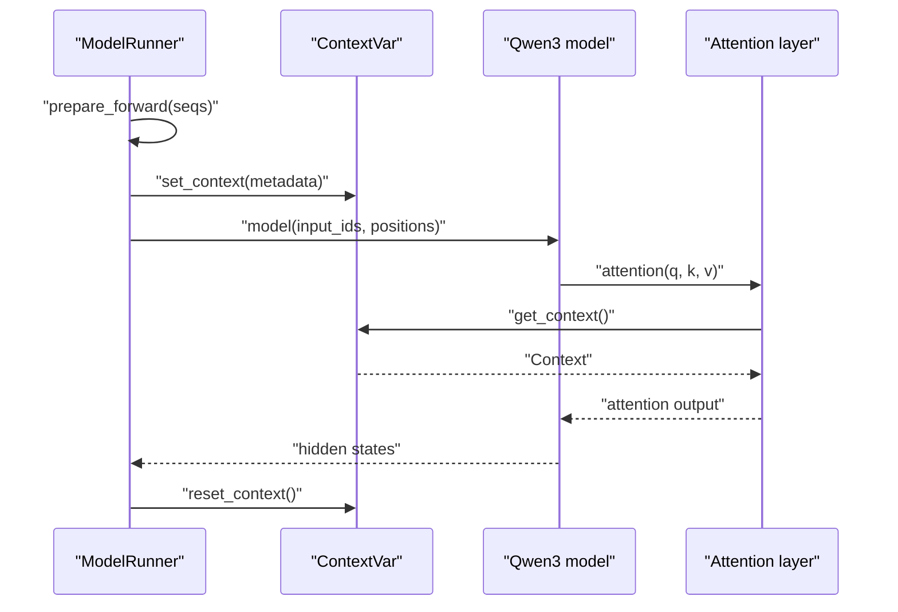
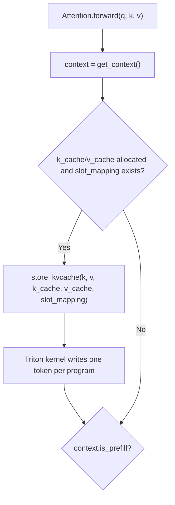
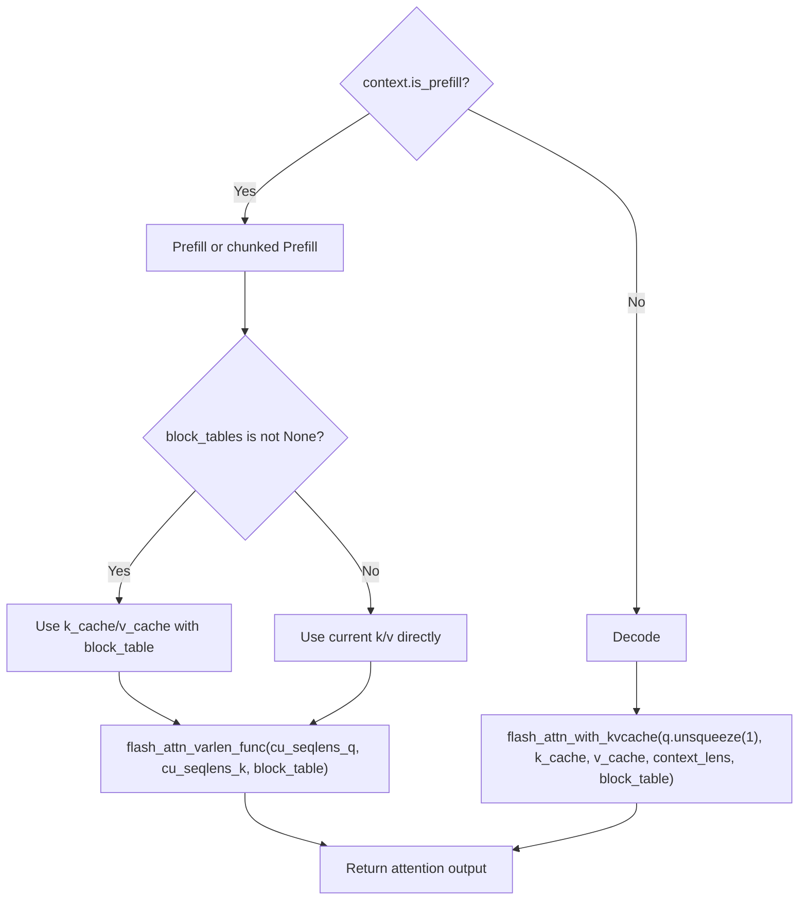

# Attention And Context

## Source Modules

- `babyvllm/utils/context.py`
- `babyvllm/layers/attention.py`
- `babyvllm/engine/model_runner.py`
- `babyvllm/models/qwen3.py`

BabyVllm stores attention metadata in a `contextvars.ContextVar`. The model layers can call `get_context()` without receiving many metadata tensors through every forward signature, while concurrent asyncio tasks keep isolated context values.

## Context Lifecycle

`Context` carries `is_prefill`, cumulative sequence lengths, max sequence lengths, `slot_mapping`, `block_tables`, and `context_lens`.

## KV Cache Write

`slot_mapping` is indexed by current input token. Each value is an absolute slot inside the preallocated KV cache, computed from `physical_block_id * block_size + block_offset`.

## Prefill And Decode Attention Paths

Prefill uses `flash_attn_varlen_func` because each sequence can contribute a different query chunk length. Decode uses `flash_attn_with_kvcache` because each sequence contributes one new query token and attends to historical K/V through the cache.

