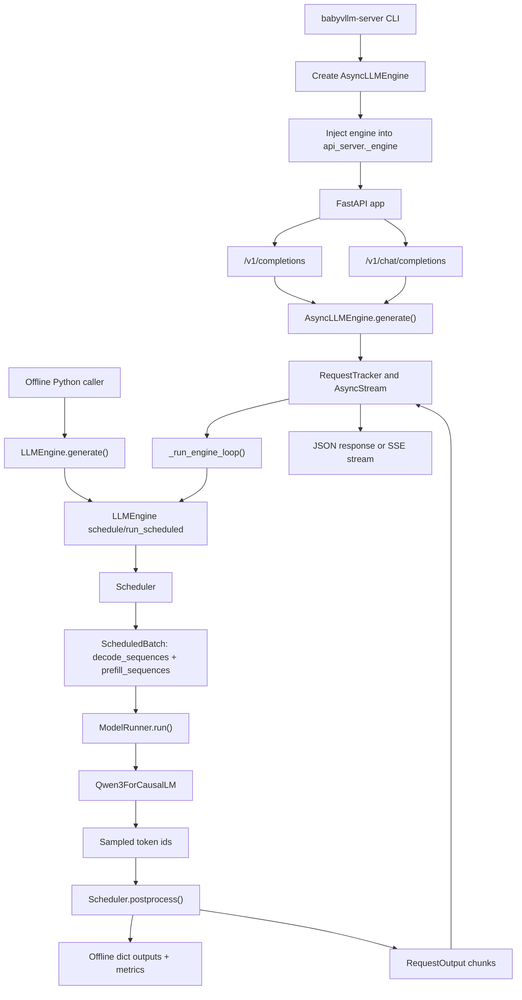

# Engine Overview

## Source Modules

- `babyvllm/entrypoints/cli.py`
- `babyvllm/entrypoints/api_server.py`
- `babyvllm/engine/llm_engine.py`
- `babyvllm/engine/async_llm_engine.py`
- `babyvllm/engine/scheduler.py`
- `babyvllm/engine/model_runner.py`
- `babyvllm/engine/outputs.py`

BabyVllm has two user-facing execution modes. Offline generation calls `LLMEngine.generate()` and blocks until all prompts finish. Online serving wraps the same synchronous engine with `AsyncLLMEngine`, `RequestTracker`, and per-request `AsyncStream` objects so each HTTP client can receive streaming chunks independently.

The scheduler returns a logical batch split into Decode and Prefill sub-batches. The engine executes Decode first, then Prefill. This keeps pure Decode forwards eligible for CUDA Graph replay while allowing new Prefill work to share the same logical scheduling step.

