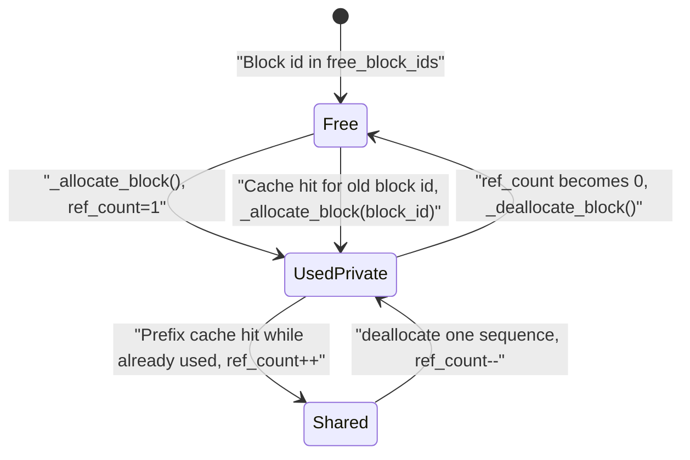
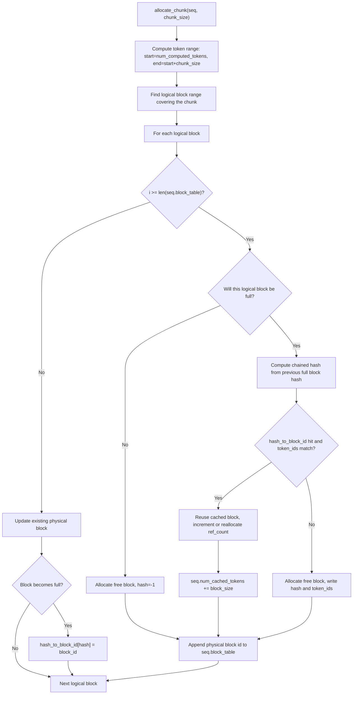
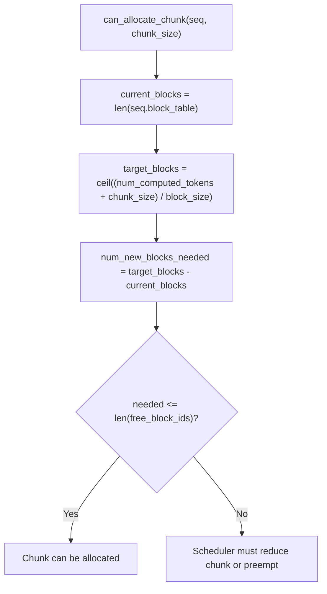
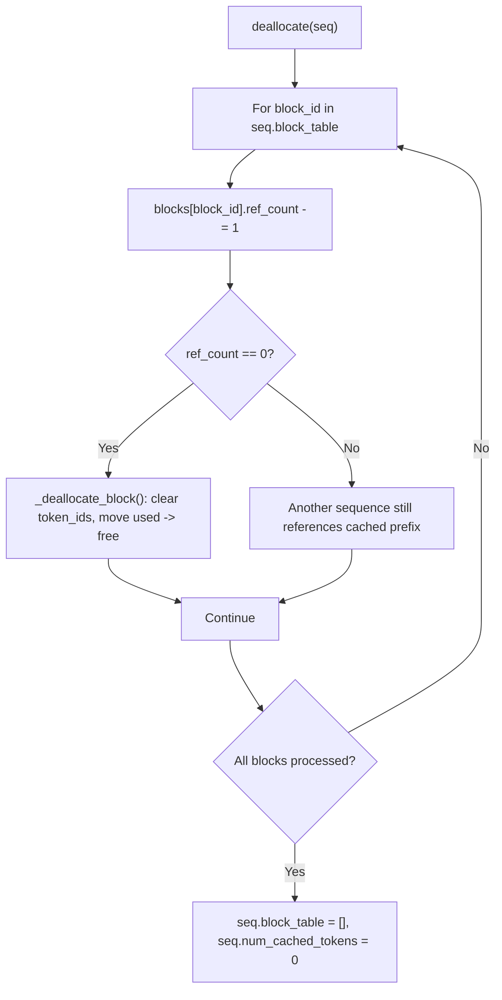

# KV Cache Block Manager

## Source Modules

- `babyvllm/engine/block_manager.py`
- `babyvllm/engine/sequence.py`
- `babyvllm/engine/model_runner.py`

`BlockManager` maps each logical sequence block to a physical KV-cache block. `Sequence.block_table` stores those physical block ids, while the model runner uses the block table to build attention metadata.

## Block State

`hash_to_block_id` is independent of the live/free state. A block can be free but still remembered as the storage location for a full historical token block. On a later prefix-cache hit, the manager can allocate that same block id again.

## Chunk Allocation

Only full blocks are inserted into `hash_to_block_id`. Partial blocks keep `hash=-1`, which avoids false prefix-cache hits and reduces hash-table churn.

## Allocation Capacity

The scheduler uses this check in two ways: Decode loops may preempt another running sequence until a one-token extension fits, while Prefill uses `_get_max_chunk_size()` to shrink the chunk to the available block budget.

## Deallocation

Deallocation does not remove full-block hashes from `hash_to_block_id`. That is intentional: the mapping records where a reusable full prefix block was stored, even if no active sequence currently references it.

