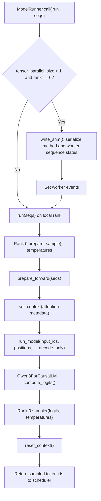
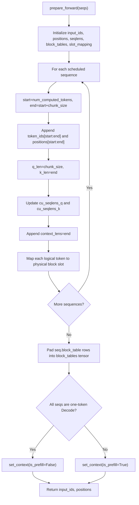
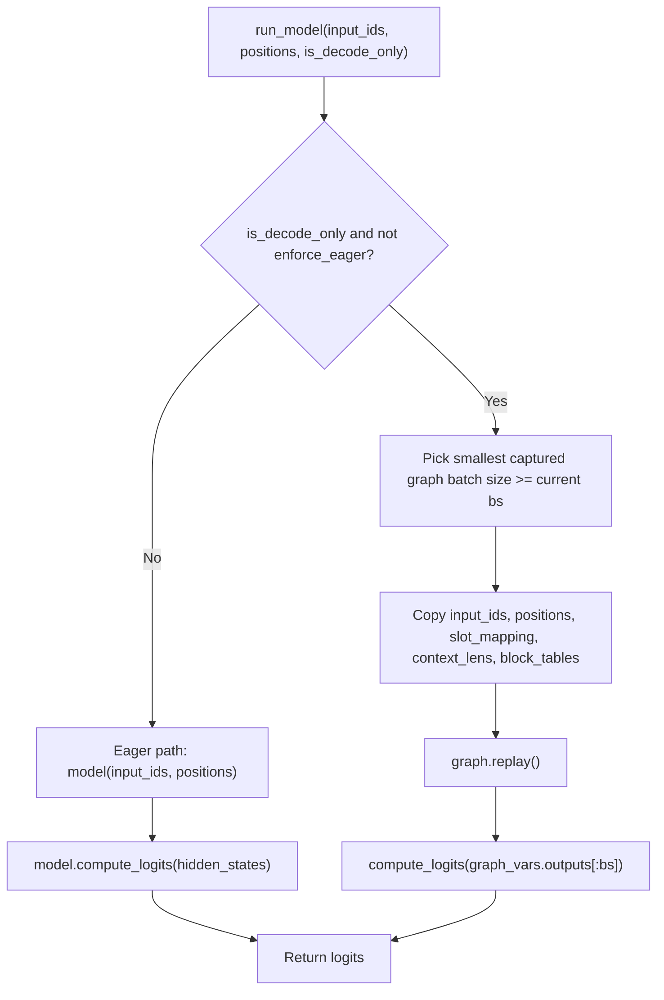

# Model Runner Forward

## Source Modules

- `babyvllm/engine/model_runner.py`
- `babyvllm/engine/sequence.py`
- `babyvllm/utils/context.py`
- `babyvllm/layers/sampler.py`
- `babyvllm/models/qwen3.py`

`ModelRunner` converts scheduled `Sequence` objects into tensors and attention metadata, runs Qwen3, computes logits, samples token ids, and resets the task-local context after every physical forward.

## Run Pipeline

Worker ranks execute the same `run()` method after rank 0 publishes a compact worker state. Decode worker states only include the current token and KV block table; Prefill states include full token ids so `prepare_forward()` can slice by absolute token index.

## `prepare_forward()` Metadata

The most important tensors are:

- `slot_mapping`: where newly computed K/V values are written in the physical KV cache.
- `block_tables`: which physical blocks contain each sequence history.
- `cu_seqlens_q`: current query chunk boundaries.
- `cu_seqlens_k`: visible context boundaries, including cached history plus the current chunk.
- `context_lens`: per-sequence visible context length for decode-with-cache.

## Eager Prefill And CUDA Graph Decode

Prefill and chunked Prefill are eager because their tensor shapes are dynamic. Pure Decode is shape-stable enough to replay a captured CUDA graph, which avoids kernel-launch overhead for the common one-token-per-sequence path.

