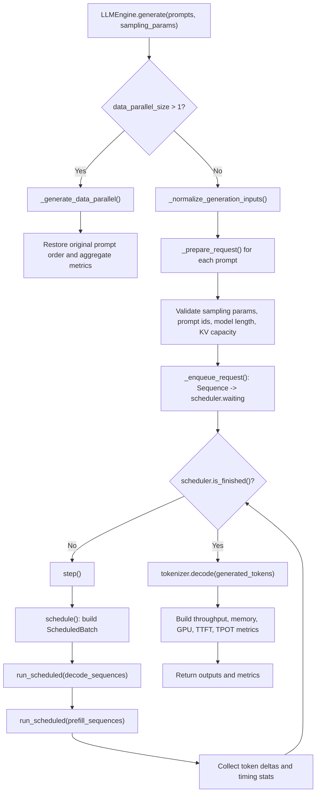
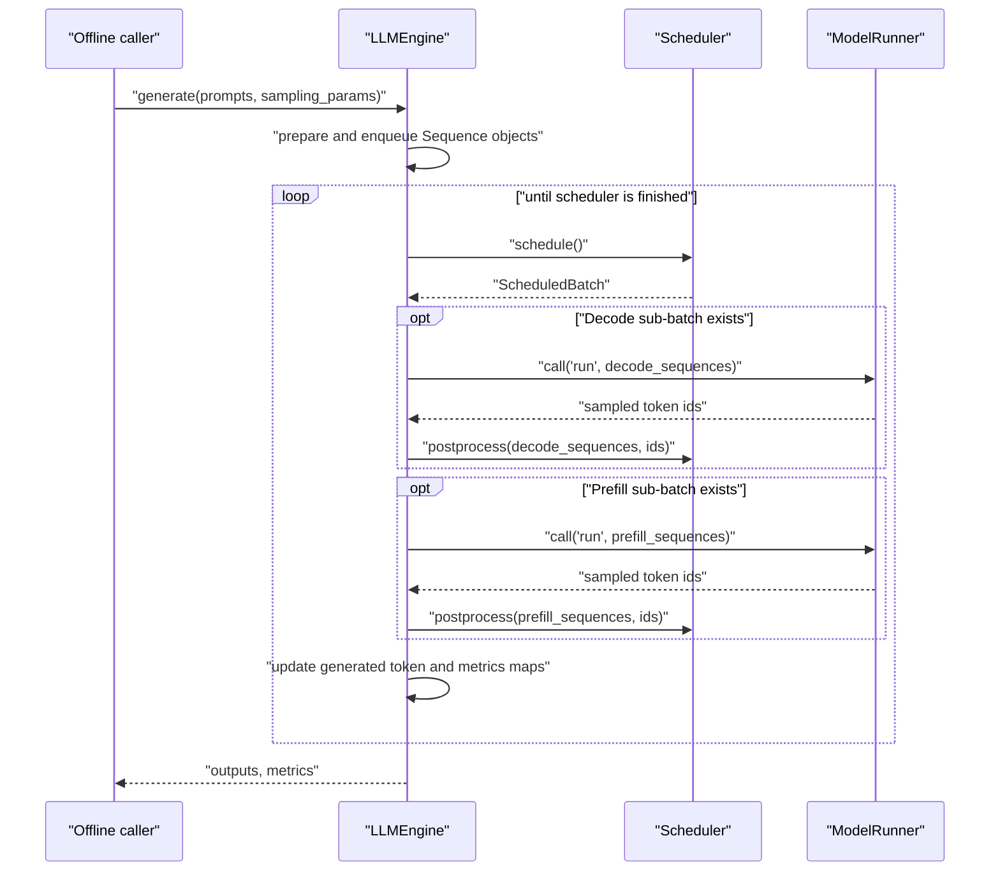

# Offline Generate

## Source Modules

- `babyvllm/engine/llm_engine.py`
- `babyvllm/engine/scheduler.py`
- `babyvllm/engine/model_runner.py`
- `babyvllm/engine/sequence.py`
- `babyvllm/sampling_params.py`

`LLMEngine.generate()` prepares a fixed list of prompts, enqueues every request, then repeatedly calls `step()` until the scheduler has no waiting or running sequences. It also collects throughput, memory, GPU utilization, TTFT, and TPOT metrics.

## Step Details

Offline mode does not use `RequestOutput`. The scheduler returns `(seq_id, token_ids, finished)` tuples, and `generate()` converts final token lists into plain dictionaries.

