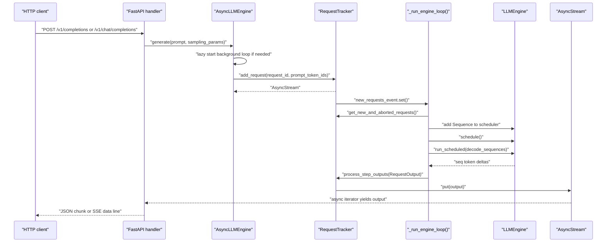
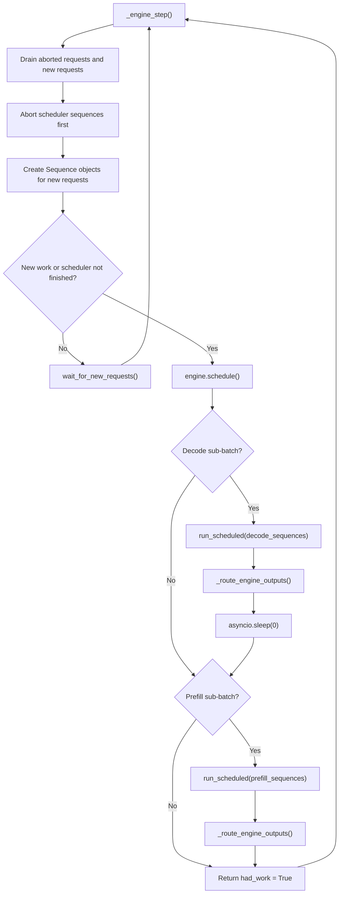
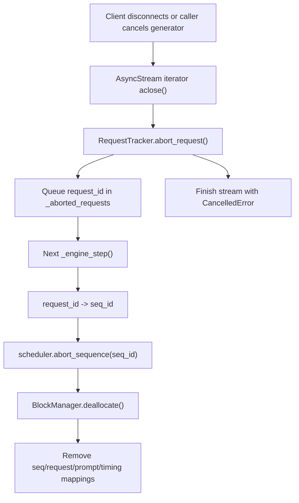

# Online Streaming

## Source Modules

- `babyvllm/engine/async_llm_engine.py`
- `babyvllm/engine/request_tracker.py`
- `babyvllm/engine/outputs.py`
- `babyvllm/entrypoints/api_server.py`

Online serving keeps request admission, scheduling, execution, and output routing inside one async engine loop. API handlers consume per-request streams while the background loop batches work across all live requests.

## Engine Loop

## Abort Path

`RequestTracker` keeps the async stream lifecycle separate from scheduler state. That makes cancellation idempotent: it can finish the stream immediately, then let the next engine iteration free KV blocks and remove scheduler entries.

