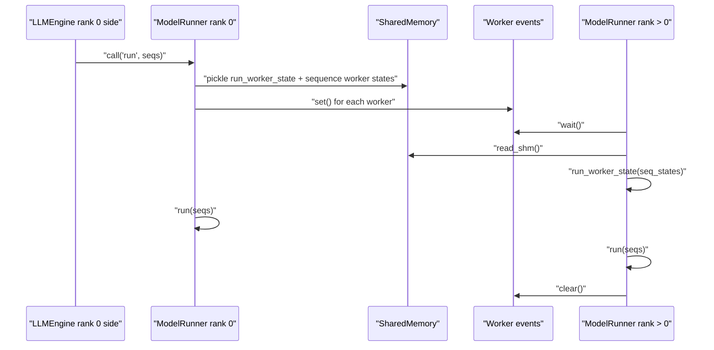
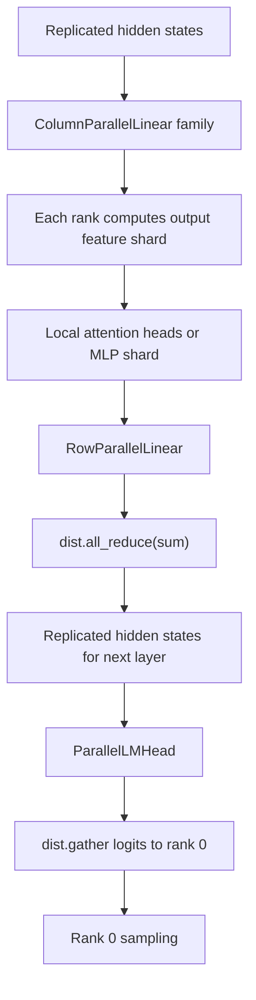
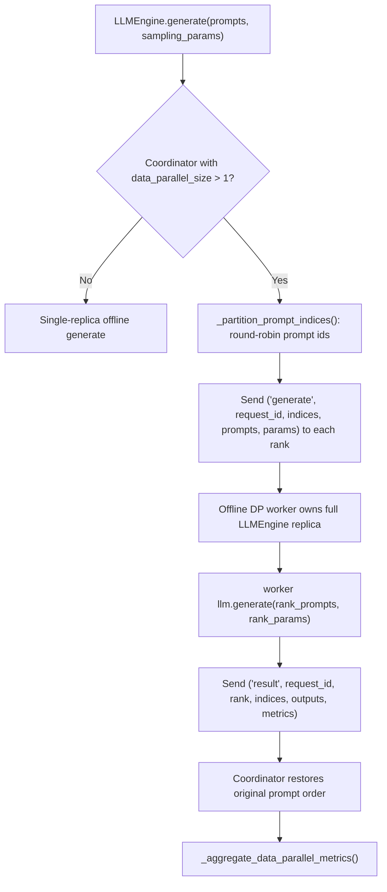
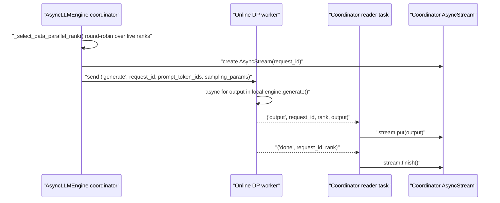

# Parallelism

## Source Modules

- `babyvllm/config.py`
- `babyvllm/engine/model_runner.py`
- `babyvllm/engine/llm_engine.py`
- `babyvllm/engine/async_llm_engine.py`
- `babyvllm/engine/sequence.py`
- `babyvllm/layers/linear.py`
- `babyvllm/layers/embedding_head.py`

BabyVllm has two parallel dimensions. Tensor parallelism splits one model replica across multiple local ranks. Data parallelism launches multiple full engine replicas and routes requests or prompt partitions across them.

## Tensor-Parallel Worker Protocol

Rank 0 serializes compact worker states through shared memory. Decode states carry only the current token plus cache metadata; Prefill states carry full tokens because workers need absolute slices for the current chunk.

## Tensor-Parallel Layer Communication

`VocabParallelEmbedding` masks non-local token ids and all-reduces embeddings. `ParallelLMHead` gathers vocab shards to rank 0, where sampling happens.

## Offline Data Parallelism

Offline DP partitions one batch by prompt index. Each worker blocks on its local `LLMEngine.generate()` call, then the coordinator merges outputs and metrics.

## Online Data Parallelism

Online DP routes each request to one full engine replica. Reader tasks keep worker Pipe messages flowing back into the coordinator's local streams. If a worker rank fails, the coordinator removes it from the live set and fails only the requests owned by that rank.

