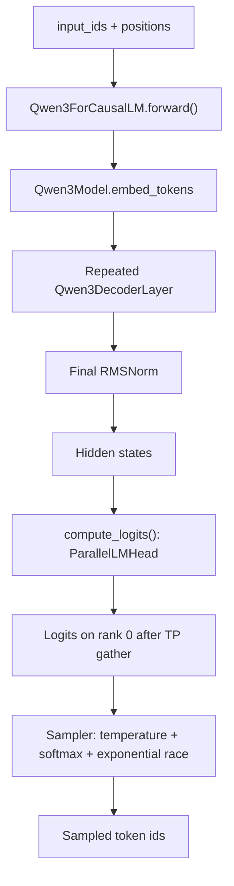
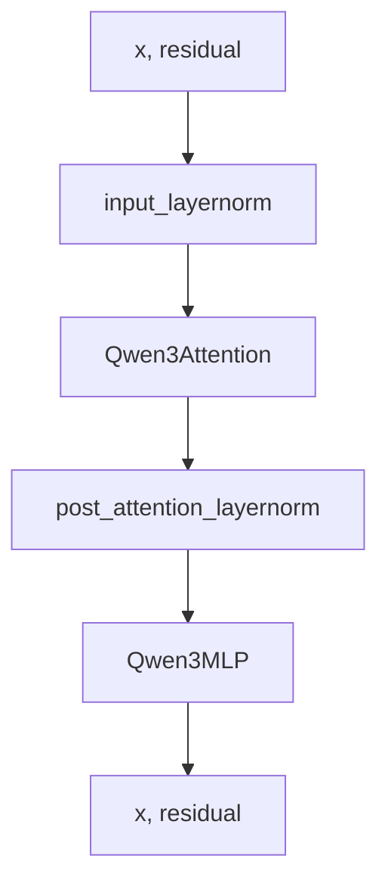
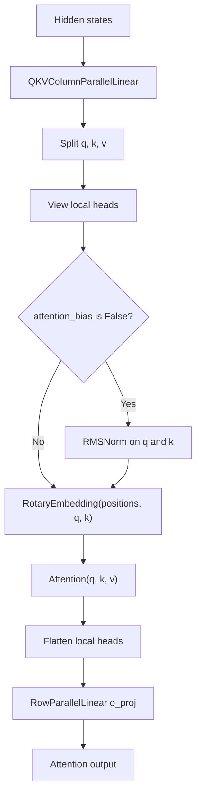
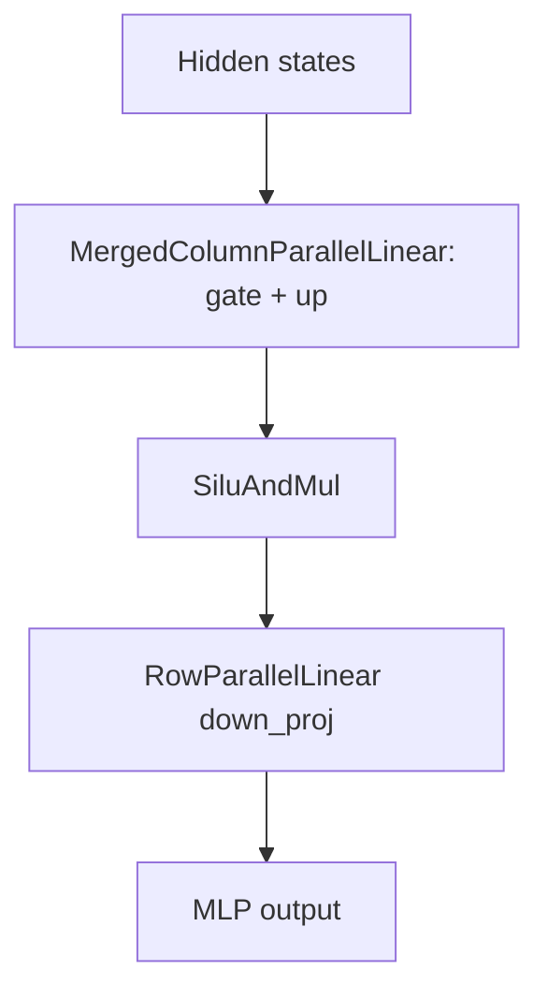

# Qwen3 Model

## Source Modules

- `babyvllm/models/qwen3.py`
- `babyvllm/layers/embedding_head.py`
- `babyvllm/layers/linear.py`
- `babyvllm/layers/attention.py`
- `babyvllm/layers/rotary_embedding.py`
- `babyvllm/layers/layernorm.py`
- `babyvllm/layers/activation.py`
- `babyvllm/layers/sampler.py`

BabyVllm implements Qwen3 as a compact causal LM stack. The model returns hidden states from `forward()`, and `ModelRunner.run_model()` calls `compute_logits()` afterward so CUDA graph replay can reuse the model forward output buffer.

## Causal LM Path

For Prefill, `ParallelLMHead` uses `context.cu_seqlens_q[1:] - 1` to select the last token of each scheduled chunk before computing logits. Decode already has one query token per sequence.

## Decoder Layer

## Attention Block

`QKVColumnParallelLinear` shards Q/K/V output features by tensor-parallel rank. `RowParallelLinear` all-reduces the projected attention output so the next block receives replicated hidden states.

## MLP Block

The gate and up projections are packed into one column-parallel layer. The down projection is row-parallel and reduces across ranks.

