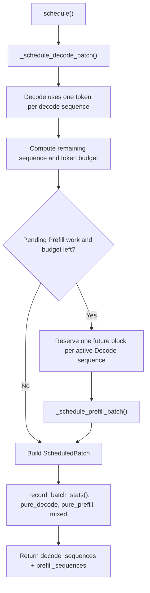
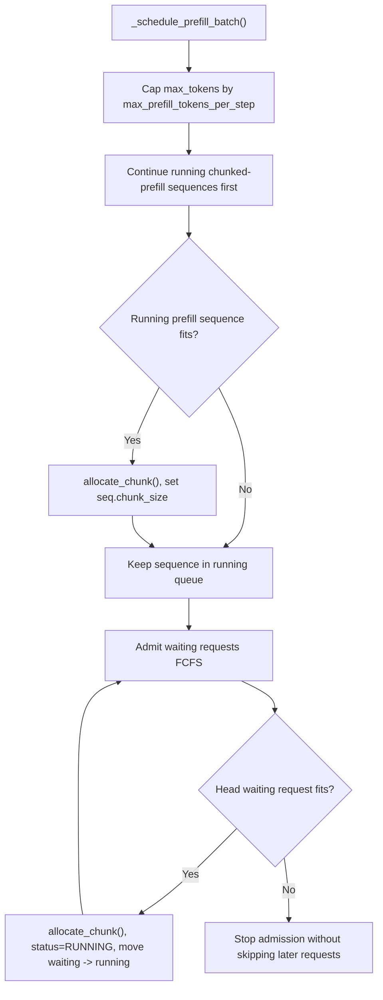
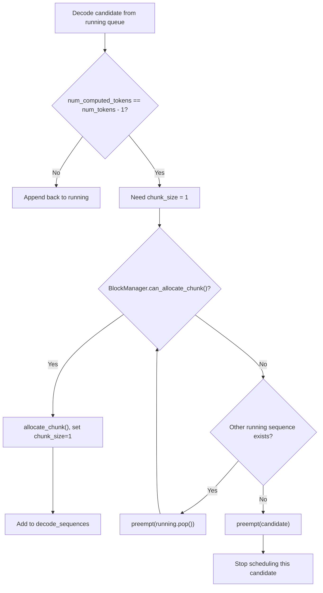
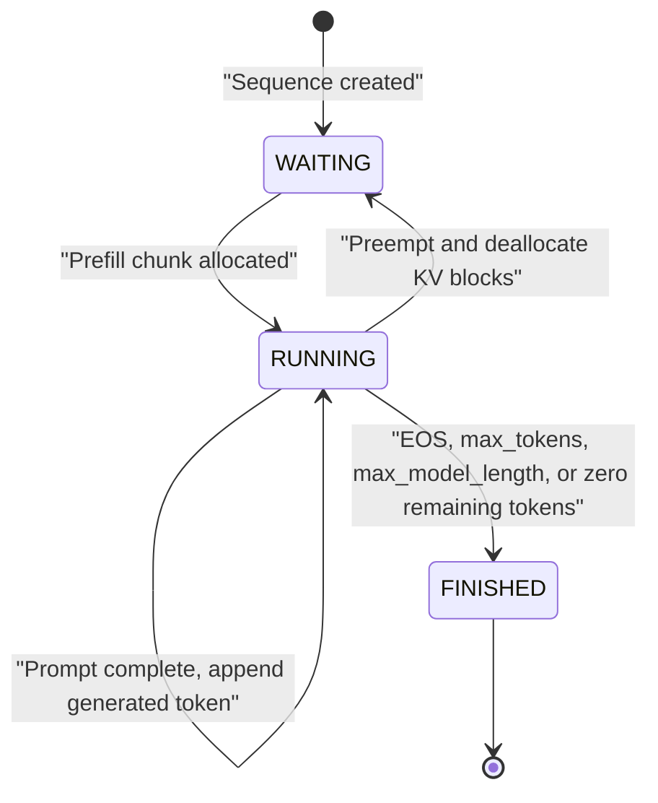
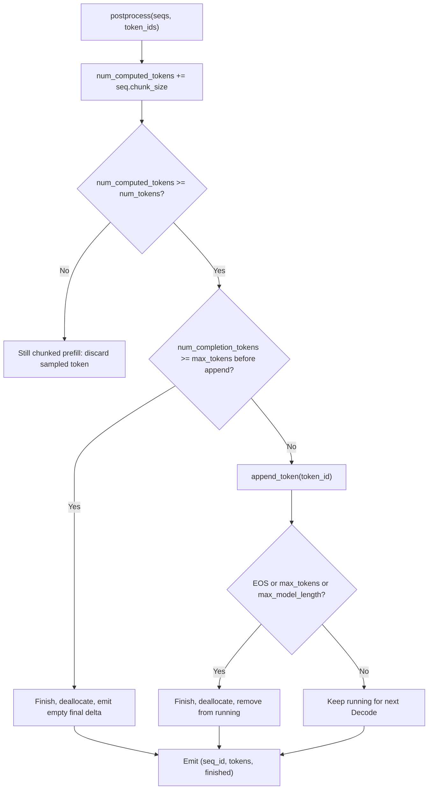

# Scheduler

## Source Modules

- `babyvllm/engine/scheduler.py`
- `babyvllm/engine/sequence.py`
- `babyvllm/engine/block_manager.py`
- `babyvllm/engine/llm_engine.py`

The scheduler owns request admission, Decode/Prefill selection, KV block allocation, preemption, and sequence state updates. It returns a `ScheduledBatch` containing separate Decode and Prefill lists. The engine runs these lists as separate physical forwards.

## Decode-First Logical Scheduling

Decode sequences are selected before Prefill so online streaming can keep token latency low. If there is still budget, the same logical step may also admit or continue Prefill work, producing a mixed logical batch.

## Prefill Selection

`max_prefill_chunk_size` prevents one long prompt from occupying the entire Prefill window. Already-running chunked prefills are continued before admitting new requests so resident partial work can make progress.

## Decode Allocation And Preemption

Preemption deallocates the sequence KV blocks, resets `num_computed_tokens` to zero, marks the sequence `WAITING`, and pushes it to the front of the waiting queue. Recovery uses `num_tokens`, not only `num_prompt_tokens`, so generated tokens are replayed as part of the reconstructed context.

## Postprocess State Transitions

Chunked Prefill may sample tokens before the prompt is complete, but those tokens are invalid as completion output. BabyVllm discards them until the last prefill chunk has been processed.
